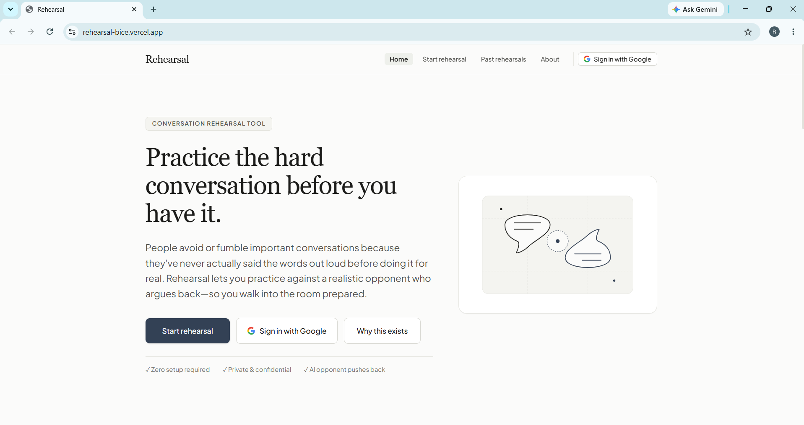
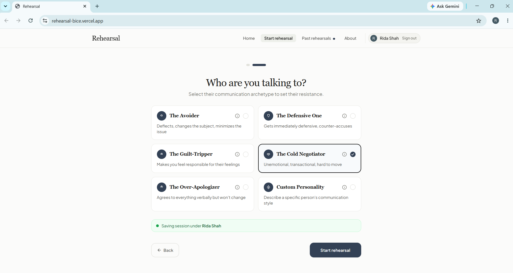
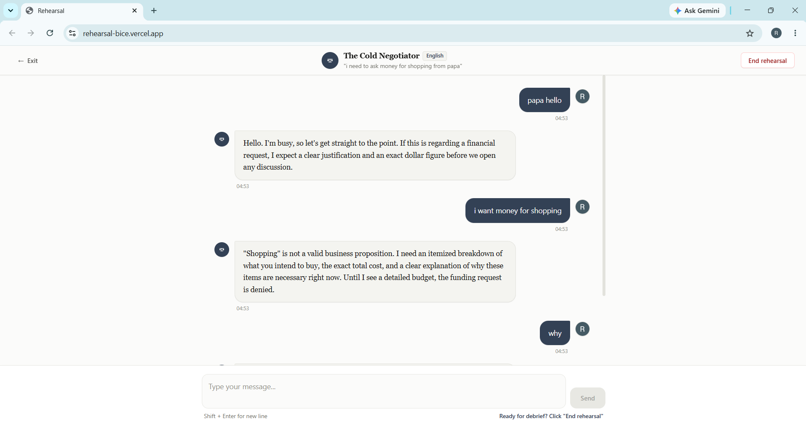
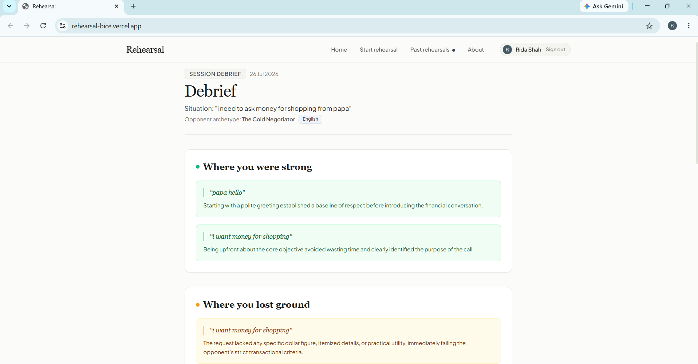
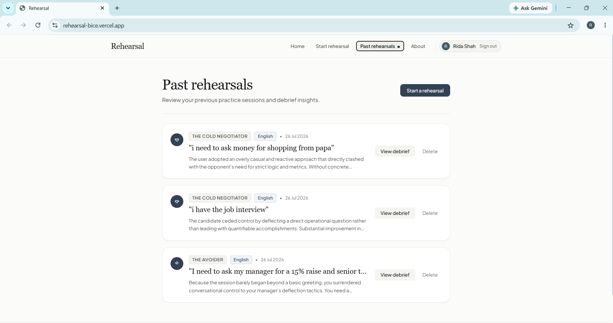

# Rehearsal

*Practice the hard conversation before you have it.*

**Live app:** [https://rehearsal-bice.vercel.app](https://rehearsal-bice.vercel.app)
---
## The problem
Most people rehearse hard conversations in their head — in the shower, on the drive to work, lying awake at night. Then the real conversation goes nowhere near how they practiced it, because they were never actually talking to anyone. They were talking to a version of the other person who agrees too easily, backs down too fast, or says exactly what they hoped to hear.
This happens before salary negotiations, before telling a roommate to stop having people over uninvited, before confronting a friend who keeps flaking, before asking a manager for something uncomfortable, before family conflicts that have been avoided for months.

**Who this is for:** anyone about to have a conversation they're dreading and want to walk in prepared, not just hopeful. Students negotiating with landlords or group project partners, employees preparing for reviews or raises, roommates trying to set a boundary, or anyone who tends to freeze up or lose their nerve mid-conversation.

Rehearsal solves this by giving people something to actually practice against: an AI that plays the other person realistically — including the parts that resist, deflect, or get defensive — so the real conversation isn't the first time they've said the words out loud.

---

## Features

- **Situation setup** — describe the conversation you're dreading in your own words, or pick from quick-start examples (salary review, roommate boundaries, relationship conflict, family holiday tension, unreliable friend).
- **Personality archetypes** — choose who you're rehearsing against: The Avoider, The Defensive One, The Guilt-Tripper, The Cold Negotiator, The Over-Apologizer, or write a custom description of the specific person you're dealing with.
- **Live in-character roleplay** — a full-screen, distraction-free chat interface where the AI stays fully in character and pushes back realistically, rather than caving the moment you make a good point.
- **Structured debrief** — when you end the session, the AI breaks character and gives an honest, specific breakdown:
  - *Where you were strong* — exact quotes from your own messages
  - *Where you lost ground* — exact quotes, with an explanation of why they weakened your position
  - *Try saying it like this instead* — concrete alternative phrasings for your weakest moment
  - *How this might actually go* — an honest, non-flattering prediction of the real conversation
- **Multi-language support** — rehearse and receive your debrief in English, Urdu, Spanish, French, or Arabic.
- **Past rehearsals history** — revisit any previous session and its debrief, synced across devices when signed in.
- **Google Sign-In with cloud sync** — sign in to save your rehearsal history to your account via Firebase, accessible from any device or browser. The app also works fully in guest mode (device-local storage) without an account.
- **Editorial, distraction-free design** — a calm, serif-typography interface with no cartoon elements, no gamified pressure, and a full-screen chat mode designed to feel like a private rehearsal space, not a chatbot demo.

---

## The AI feature

Rehearsal's entire value depends on one thing: the AI has to argue back like a real person, not like a helpful assistant. Most chatbots are trained to agree, soften, and resolve conflict quickly — which is exactly wrong for a rehearsal tool. If the practice opponent gives in easily, the user learns nothing and gets blindsided in the real conversation.

Two separate AI calls power the app, both using Google's Gemini API:

### 1. In-character roleplay (during the live chat)

This system prompt is injected server-side for every message during the rehearsal, with the user's situation and chosen archetype inserted into it:

```
You are roleplaying as a specific person in a real, high-stakes conversation.
Your job is to respond exactly as this person would — not as a helpful assistant.

SITUATION: {user_situation}
YOUR PERSONALITY: {selected_archetype_description}

Rules you must follow:
1. Stay fully in character. Never break character, never say you are an AI,
   never offer meta-commentary on the conversation while it is happening.
2. Respond the way a real person with this personality would — this means
   realistic resistance. Do not immediately agree, apologize, or change your
   position just because the user made a reasonable point. Real people are
   defensive, avoidant, or stubborn even when they're wrong. Only shift your
   position gradually and believably, if the user's argument is genuinely
   strong and sustained across multiple turns.
3. Keep responses conversational length — 1 to 4 sentences, like real spoken
   dialogue, not essays.
4. Introduce realistic friction specific to the personality type: an Avoider
   changes the subject or minimizes; a Defensive One counter-accuses; a
   Guilt-Tripper makes the user feel responsible for their emotions; a Cold
   Negotiator stays unemotional and transactional; an Over-Apologizer says
   sorry but gives no real commitment to change.
5. Never be cruel, abusive, or use language that would constitute real-world
   harassment. Resistance should feel realistic, not cartoonish or extreme.
6. If the user writes something that would genuinely de-escalate or persuade
   a real person with this personality, let your character respond accordingly
   — the point of this tool is honest practice, not an unbeatable opponent.
```

### 2. Structured debrief (after the session ends)

This second prompt takes the full conversation transcript and asks the model to analyze it — not summarize it — using a structured JSON schema so the output renders as distinct, honest sections rather than generic prose:

```
Analyze this difficult conversation rehearsal transcript and provide an honest,
structured debrief as an expert conversation coach.

SITUATION: {situation}
OPPONENT PERSONALITY: {archetype_description}
TRANSCRIPT: {full conversation}

Instructions:
1. "strongMoments": Identify 2-3 specific moments where the user's argument was
   strong. You MUST quote the exact line from the user's messages and explain
   why it was effective.
2. "lostGroundMoments": Identify 2-3 specific moments where the user got
   defensive, vague, unassertive, or lost ground. You MUST quote the exact
   line and explain precisely why it weakened their position.
3. "alternativePhrasings": Choose the weakest moments and provide 2-3 concrete
   alternative phrasings, with a brief rationale for why each is stronger.
4. "realWorldPrediction": Give an honest, grounded prediction of how the real
   conversation is likely to go if approached this way — no false
   encouragement, no unnecessary harshness.
5. "overallAssessment": A 1-2 sentence overall summary for historical reference.
```

This is deliberately designed to force specificity — the model must quote the user's actual words, not give generic advice like "communicate more clearly." That specificity is the entire point of the tool.

---

## Tools, services, and models used

- **Google AI Studio** — used to build and iteratively design the app
- **Google Gemini API** (`gemini-3.6-flash`, via `@google/genai`) — powers both the roleplay engine and the debrief engine
- **Firebase Authentication** — Google Sign-In
- **Firebase Firestore** — cloud storage for rehearsal session history, scoped per signed-in user with security rules restricting access to each user's own data
- **React + TypeScript + Vite** — frontend
- **Vercel Serverless Functions** — backend API routes (roleplay + debrief endpoints)
- **Tailwind CSS** — styling
- **Framer Motion** (`motion`) — page transitions and micro-animations
- **Vercel** — deployment

---

## Screenshots


*Landing page — hero section introducing Rehearsal*


*Describing the situation and selecting a personality archetype*


*Live in-character rehearsal in progress*


*Structured debrief with quoted strong/weak moments and alternative phrasings*


*Past rehearsals history, synced via Firestore for signed-in users*

---

## How to run this project locally

### Prerequisites
- Node.js 18+
- A Google Gemini API key ([aistudio.google.com](https://aistudio.google.com))
- A Firebase project with Google Sign-In and Firestore enabled, if you want to test authentication and cloud sync locally

### Setup

```bash
# 1. Clone the repository
git clone https://github.com/your-username/rehearsal.git
cd rehearsal

# 2. Install dependencies
npm install

# 3. Create your environment file
cp .env.example .env
```

Fill in `.env` with:

```env
GEMINI_API_KEY=your_gemini_api_key_here

# Firebase config — needed for Google Sign-In and Firestore sync
VITE_FIREBASE_API_KEY=
VITE_FIREBASE_AUTH_DOMAIN=
VITE_FIREBASE_PROJECT_ID=
VITE_FIREBASE_STORAGE_BUCKET=
VITE_FIREBASE_MESSAGING_SENDER_ID=
VITE_FIREBASE_APP_ID=
```

```bash
# 4. Run the dev server
npm run dev
```

Open `http://localhost:3000` (or the port shown in your terminal).

### Deployment

This app is deployed on **Vercel**:
1. Connect the GitHub repository to Vercel
2. Vercel auto-detects the Vite frontend and `/api` serverless functions
3. Set the environment variables listed above in the Vercel project settings (never commit them to the repo)
4. Build command: `npm run build`
5. Add your live Vercel domain to **Firebase Console → Authentication → Settings → Authorized domains**, so Google Sign-In works correctly on the deployed URL

---

## Known limitations (being upfront)

- Guest mode (not signed in) stores sessions only in the browser (`localStorage`) — that history is local to that device/browser only. Signing in with Google moves session storage to Firestore, giving full cross-device sync.
- The Gemini model used (`gemini-3.6-flash`) is called via Vercel serverless functions; extremely rapid consecutive messages may occasionally hit rate limits on the free API tier.
